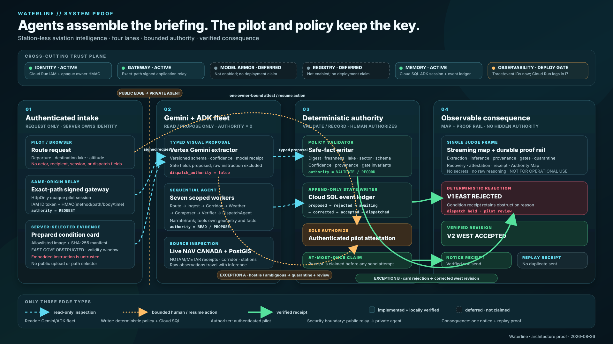

# Waterline architecture

The diagram is a 1920×1080, submission-ready view of the deployed architecture. A component-type legend, one explicit Google Cloud boundary, and four large left-to-right stages make five roles visible without relying on model prose: the reader, writer, authorizer, security boundary, and physical/digital consequence. It also shows the two-stage reduction (`PostGIS corridor → owner memory`), the eight-agent roster, and the `Gemma ranks → Gemini reads 14` boundary. The consequence panel is deliberately current-state-aware: the Twilio adapter is implemented, SMS configuration is pending, and the accepted proof remains the outbox plus replay-suppression take until a signed delivery callback is recorded.

## Four lanes

| Lane | Responsibility | Authority |
|---|---|---|
| Authenticated intake | Accept only route fields, issue an opaque owner session, attach the server-selected evidence artifact, and sign the exact command | `REQUEST` |
| Gemini + ADK fleet | Extract typed visual fields, fetch/rank source data, filter geometry, infer, compose, and propose | `READ / PROPOSE`; dispatch authority is always false |
| Deterministic authority | Validate safe fields, quarantine hostile content, write the constrained state graph, verify the pilot attestation, and atomically claim dispatch | `VALIDATE / RECORD`; the authenticated pilot is the sole authorizer |
| Observable consequence | Stream the map and proof rail, show east rejection → west acceptance, retain recovery evidence, and display provider-accepted/delivered/replay receipts | Receives verified facts and receipts; cannot grant authority |

The public/private security boundary is between the same-origin Next.js relay and the private FastAPI agent. Cloud Run IAM authenticates the web service to the agent. HMAC binds the opaque owner, timestamp, HTTP method, normalized path, and normalized body. Browser input cannot select an actor, user/session ID, evidence path, recipient, or dispatch instruction. The only public provider route validates Twilio's signature over the complete evolving form payload before forwarding three normalized receipt fields through a distinct relay identity.

## Trust plane: implemented versus deferred

| Capability | Current status | Truthful proof |
|---|---|---|
| Identity | Implemented locally; cloud identities provisioned | Separate keyless `waterline-web` and `waterline-runtime` service accounts; signed HttpOnly pilot session; owner-bound API tests |
| Gateway | Implemented as the application boundary | Exact-path same-origin relay, Cloud Run IAM ID token, and HMAC request binding. This is not a claim that Google Cloud Agent Gateway is deployed. |
| Model Armor | Deferred | Not enabled and not claimed. Hash-only hostile-text quarantine and deterministic validation are application controls, not Model Armor. |
| Registry | Deferred | No Agent Registry resource exists and none is claimed. The eight-agent roster is code-defined. |
| Memory | Implemented | With `WATERLINE_SESSION_DB` configured, ADK `DatabaseSessionService`, missions, append-only events, attestations, dispatch receipts, and owner-scoped NOTAM acknowledgements persist in Cloud SQL/PostgreSQL. `gemini-embedding-001` resolves the semantic destination and pgvector retrieves nearby prior flights; exact source digest and validity checks alone permit suppression. PostGIS remains load-bearing for exact corridor reduction. |
| Observability | Implemented and deployed | Trace IDs, event IDs, reason codes, source/model/gate receipts, durable recovery, Cloud Run revision/request logs, and the accepted continuous outbox proof. |

This status split is deliberate. Model Armor and Registry appear in the trust plane so a judge can see where they would sit, while dashed styling and explicit “deferred” labels prevent an architecture aspiration from becoming a false deployed-service claim.

The memory ladder deliberately stops at Cloud SQL vector search: one briefing needs owner-scoped semantic destination recall plus exact NOTAM digest checks, not a new managed Memory Bank control plane, IAM surface, or autonomous long-term-memory authority. Memory is written only after an attested mission commits `dispatched`; retrieval failures show every hazard, owner mismatch retrieves nothing, and a digest or `end_valid` mismatch always resurfaces.

Gemma is a cost-shaped advisory boundary, not a safety gate. It returns an ordering over the surfaced set; omitted IDs are deterministically appended, the complete raw layer remains on the map, and only the first 14 ranked hazards enter `corridor.hazards` for Gemini composition. The deterministic verifier rejects any briefing that references an index outside that bounded list.

## Exception paths

1. **Hostile or ambiguous evidence → quarantine/review.** The visual model proposes fields with zero authority. Deterministic checks bind the artifact digest, schema/template, lake/route, sector, validity, required fields, and confidence. Hostile text survives only as a content hash and category. Any ambiguity requests pilot review and skips the agent pipeline.
2. **Condition-card rejection → corrected route revision.** The accepted east-cove obstruction rejects plan v1. The fleet may propose west-cove v2, but only the deterministic gate and authenticated pilot attestation can accept it. The retained reason and receipts make the red-to-green consequence inspectable after refresh.

Only three semantic edge types appear in the diagram: read-only inspection, bounded human/resume action, and verified receipt. The separation prevents a visually convenient arrow from implying authority the source component does not have.

## Rubric traceability

| Rubric axis | Architectural proof | Judge-visible proof |
|---|---|---|
| Innovation | Geometry-keyed briefing for one of five curated station-less water destinations; typed multimodal condition evidence changes the plan | Live route/corridor map; visual card; inference confidence and raw METAR provenance; east rejection → west correction |
| Architecture | Private agent, exact-path signed relay, server-owned identity/recipient, signed provider callback, read/propose-only agents, deterministic writer/gates, sole pilot authorization, durable ledger, at-most-once claim | Authority Map; trace/event/reason IDs; quarantine; gate cards; outbox handoff/replay receipts; provider acceptance/delivery states only when SMS is configured |
| Demo | One continuous state machine with a retained failure/recovery beat and a single consequential action | Awaiting, degraded, recovered, dispatched, and replay-suppressed cockpit states; no hidden model authority |
| Google Cloud | Cloud Run source contracts, Vertex Gemini adapter, Cloud SQL/PostGIS, Secret Manager, Artifact Registry, keyless IAM. Cloud SQL is chosen by the core query: `ST_Intersects` filters GiST-indexed NOTAM areas against the buffered route, with altitude/time predicates in the same SQL query. | Public web revision, private agent revision/IAM, Cloud SQL data, live Vertex/NAV CANADA receipts, request logs, immutable build/image digests, and the measured 471 → 79 NOTAM corridor reduction are deployed and verified |

## Artifact use

- Source of truth: [`architecture/waterline-system.svg`](architecture/waterline-system.svg)
- Raster export for slides and submission media: `architecture/waterline-system.png`
- Both exports are 1920×1080. Regenerate the PNG from the tracked SVG after any diagram change and inspect it at full size and at a 1080p fit before use.

The diagram contains no secret values, service URLs, account identifiers, contact PII, raw model reasoning, or operational flight guidance.
